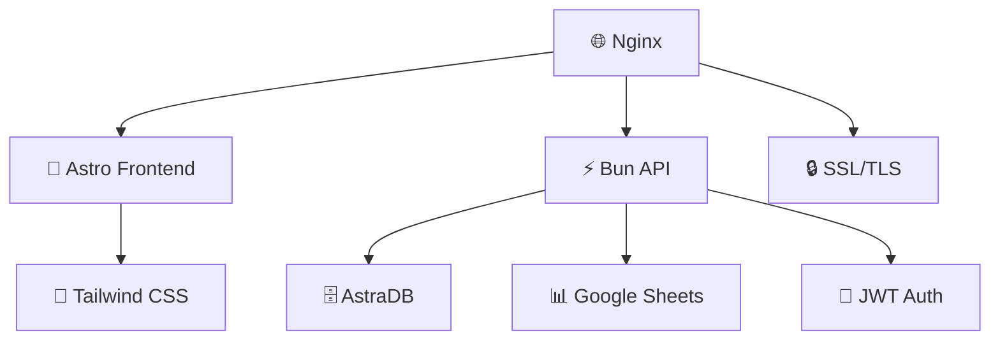

<div align="center">

# 🏢 Sagawa Group
### Modern Company Profile Website


[](https://www.sagawagroup.id)
[](LICENSE)
[](README-PRODUCTION.md)

---

**Modern full-stack web application built with cutting-edge technologies**

*Featuring Astro frontend, Bun backend, and AstraDB with production-grade deployment*

[](https://astro.build/)
[](https://bun.sh/)
[](https://www.typescriptlang.org/)
[](https://tailwindcss.com/)
[](https://astra.datastax.com/)

</div>

---

## ✨ Features

<table>
<tr>
<td width="50%">

### 🚀 **Performance**
- ⚡ **Lightning Fast** - Astro Static Site Generation
- 🔄 **Zero Downtime** - PM2 with reload strategy
- 📦 **Optimized Bundle** - Tree shaking & code splitting
- 🗂️ **PWA Ready** - Service worker & offline support

</td>
<td width="50%">

### 🔒 **Security**
- 🛡️ **SSL/TLS 1.3** - Auto-renewal with Let's Encrypt
- 🔐 **JWT Auth** - Secure token-based authentication
- 🚫 **Rate Limiting** - DDoS protection
- 🔒 **HSTS & CSP** - Security headers enabled

</td>
</tr>
<tr>
<td width="50%">

### 🎨 **Modern UI/UX**
- 📱 **Responsive Design** - Mobile-first approach
- 🎯 **Component-Based** - Reusable Astro components
- 🖼️ **Lazy Loading** - Optimized image loading
- 🎪 **Admin Dashboard** - Full management interface

</td>
<td width="50%">

### 🔧 **Developer Experience**
- 🏗️ **TypeScript** - Type-safe development
- 🎛️ **One-Click Deploy** - Automated production scripts
- 📊 **Google Sheets** - Data synchronization
- 🔄 **Hot Reload** - Instant development feedback

</td>
</tr>
</table>

---

## 🚀 Quick Start

### Prerequisites

```bash
# Required tools
- Bun >= 1.0.0
- Node.js >= 18.0.0
- Git
```

### ⚡ Installation

```bash
# 1. Clone the repository
git clone https://github.com/tsubametaa/sagawagroup.git
cd sagawagroup

# 2. Backend Setup
cd bun-api
bun install
cp .env.example .env
# Configure your environment variables
bun run dev

# 3. Frontend Setup (new terminal)
cd vue-frontend
npm install
npm run dev
```

<div align="center">

**🎉 Your application is now running!**

Frontend: [`http://localhost:4321`](http://localhost:4321) | Backend: [`http://localhost:3000`](http://localhost:3000)

</div>

---

## 🏗️ Architecture

<div align="center">



</div>

### 📁 Project Structure

```
sagawagroup/
├── 📁 bun-api/                    # 🔥 Bun Backend API
│   ├── 📄 index.ts               # Entry point server
│   ├── 📁 src/
│   │   ├── 📁 controllers/       # Request handlers
│   │   ├── 📁 models/            # Data models & schemas
│   │   ├── 📁 routes/            # API route definitions
│   │   ├── 📁 services/          # Business logic
│   │   └── 📁 utils/             # Helper functions
│   └── 📁 uploads/               # File uploads directory
│
├── 📁 vue-frontend/              # ⚡ Astro Frontend
│   ├── 📄 astro.config.mjs       # Astro configuration
│   ├── 📄 Manifest.json          # PWA manifest
│   └── 📁 src/
│       ├── 📁 components/        # Reusable UI components
│       ├── 📁 layouts/           # Page layouts
│       ├── 📁 pages/             # Route pages
│       └── 📁 assets/            # Images & media
│
├── 🚀 deploy-production.sh       # One-click production deployment
├── 🔒 setup-ssl.sh               # SSL certificate setup
├── 📦 production-build.sh        # Production build script
├── 💾 backup.sh                  # Automated backup
├── ⚙️ ecosystem.config.js        # PM2 configuration
└── 🌐 nginx-sagawagroup.conf     # Nginx configuration
```

---

## 🛠️ Tech Stack

<div align="center">

### Frontend Stack
[](https://astro.build/)
[](https://www.typescriptlang.org/)
[](https://tailwindcss.com/)
[](https://lucide.dev/)

### Backend Stack
[](https://bun.sh/)
[](https://www.typescriptlang.org/)
[](https://jwt.io/)

### Database & Services
[](https://astra.datastax.com/)
[](https://sheets.google.com/)

### DevOps & Deployment
[](https://nginx.org/)
[](https://pm2.keymetrics.io/)
[](https://letsencrypt.org/)

</div>

---

## 🌐 Production Deployment

<div align="center">

### 🚀 One-Click Production Deploy

Deploy to **www.sagawagroup.id** with SSL certificate in minutes!

</div>

```bash
# 🚀 Full production deployment with SSL
sudo ./deploy-production.sh

# 🔧 Production build only
./production-build.sh

# 🔒 SSL setup only
sudo ./setup-ssl.sh
```

### 🎯 Production Features

<table>
<tr>
<td align="center" width="25%">

**🌐 HTTP/2**
<br>
Enabled by default

</td>
<td align="center" width="25%">

**🔒 SSL/TLS 1.3**
<br>
Auto-renewal

</td>
<td align="center" width="25%">

**📦 GZIP**
<br>
70% compression

</td>
<td align="center" width="25%">

**🚫 Rate Limiting**
<br>
DDoS protection

</td>
</tr>
</table>

> **📖 Complete Guide**: See [README-PRODUCTION.md](README-PRODUCTION.md) for detailed deployment instructions

---

## 📚 API Reference

### 🔐 Authentication

| Method | Endpoint | Description |
|--------|----------|-------------|
| `POST` | `/api/auth/register` | User registration |
| `POST` | `/api/auth/login` | User login |
| `GET` | `/api/auth/profile` | Get user profile |
| `PUT` | `/api/auth/profile` | Update profile |

### 👥 Mitra Management

| Method | Endpoint | Description |
|--------|----------|-------------|
| `GET` | `/api/mitra` | Get all partners |
| `POST` | `/api/mitra` | Create new partner |
| `POST` | `/api/mitra/login` | Mitra login |
| `PUT` | `/api/mitra/:id` | Update partner |

### 📋 Agreements

| Method | Endpoint | Description |
|--------|----------|-------------|
| `GET` | `/api/agreements` | Get all agreements |
| `POST` | `/api/agreements` | Create agreement |
| `PUT` | `/api/agreements/:id` | Update agreement |

### 📊 Google Sheets Integration

| Method | Endpoint | Description |
|--------|----------|-------------|
| `POST` | `/api/sheets/sync` | Sync with sheets |
| `GET` | `/api/sheets/data` | Get sheet data |

---

## 💻 Development

### 🔧 Available Commands

<table>
<tr>
<td width="50%">

**Backend Commands**
```bash
# Development
bun run dev

# Production
bun run build
bun run start

# Testing
bun test
```

</td>
<td width="50%">

**Frontend Commands**
```bash
# Development
npm run dev

# Production
npm run build
npm run preview

# Utilities
npm run astro check
```

</td>
</tr>
</table>

### 🔄 Production Commands

```bash
# 🚀 One-click deployment
sudo ./deploy-production.sh

# 💾 Backup & Restore
./backup.sh
./restore.sh

# 🔧 Process Management
pm2 status
pm2 logs sagawagroup-api
pm2 restart sagawagroup-api
```

---

## 🗄️ Database Schema

<details>
<summary><strong>📋 Click to view database tables</strong></summary>

### Users Table
```sql
CREATE TABLE users (
  id UUID PRIMARY KEY,
  email TEXT UNIQUE,
  password TEXT,
  full_name TEXT,
  phone TEXT,
  created_at TIMESTAMP,
  updated_at TIMESTAMP
);
```

### Mitra Table
```sql
CREATE TABLE mitra (
  id UUID PRIMARY KEY,
  name TEXT,
  email TEXT,
  phone TEXT,
  address TEXT,
  bank_account TEXT,
  status TEXT,
  created_at TIMESTAMP,
  updated_at TIMESTAMP
);
```

### Agreements Table
```sql
CREATE TABLE agreements (
  id UUID PRIMARY KEY,
  mitra_id UUID,
  title TEXT,
  content TEXT,
  status TEXT,
  created_at TIMESTAMP,
  updated_at TIMESTAMP
);
```

### Admin Table
```sql
CREATE TABLE admin (
  id UUID PRIMARY KEY,
  username TEXT UNIQUE,
  email TEXT,
  password TEXT,
  role TEXT,
  created_at TIMESTAMP,
  updated_at TIMESTAMP
);
```

</details>

---

## ⚙️ Environment Configuration

<details>
<summary><strong>🔧 Backend Environment (.env)</strong></summary>

```env
# AstraDB Configuration
ASTRA_DB_APPLICATION_TOKEN=your_astra_db_token
ASTRA_DB_API_ENDPOINT=your_astra_db_endpoint
ASTRA_DB_KEYSPACE=your_keyspace

# JWT Configuration
JWT_SECRET=your_super_secret_jwt_key
JWT_EXPIRES_IN=7d

# Email Service
EMAIL_SERVICE_API_KEY=your_email_service_key
EMAIL_FROM=noreply@sagawagroup.com

# Server Configuration
PORT=3000
NODE_ENV=development
FRONTEND_URL=http://localhost:4321
```

</details>

<details>
<summary><strong>🎨 Frontend Environment (.env)</strong></summary>

```env
# API Configuration
PUBLIC_API_URL=http://localhost:3000
PUBLIC_API_VERSION=v1

# Site Configuration
PUBLIC_SITE_URL=http://localhost:4321
PUBLIC_SITE_NAME=SagawaGroup
```

</details>

---

## 📈 Performance Metrics

<div align="center">

| Metric | Development | Production |
|--------|-------------|------------|
| **First Load** | < 1s | < 2s |
| **API Response** | < 50ms | < 200ms |
| **SSL Handshake** | N/A | < 100ms |
| **Bundle Size** | N/A | 70% compressed |

</div>

---

## 🤝 Contributing

We welcome contributions! Please follow these steps:

1. **Fork** the repository
2. **Create** your feature branch (`git checkout -b feature/amazing-feature`)
3. **Commit** your changes (`git commit -m 'Add amazing feature'`)
4. **Push** to the branch (`git push origin feature/amazing-feature`)
5. **Open** a Pull Request

### 📋 Development Guidelines

- ✅ Use TypeScript for type safety
- ✅ Follow ESLint and Prettier configuration
- ✅ Write tests for new features
- ✅ Update documentation when needed
- ✅ Use conventional commits

---

## 🔍 Monitoring & Support

### 🆘 Health Checks
- **Website**: [www.sagawagroup.id](https://www.sagawagroup.id)
- **API Health**: [www.sagawagroup.id/api/health](https://www.sagawagroup.id/api/health)
- **SSL Status**: Use SSL Labs test

### 📞 Support Channels
- 📧 **Email**: support@sagawagroup.com
- 🐛 **Issues**: [GitHub Issues](https://github.com/tsubametaa/sagawagroup/issues)
- 📖 **Documentation**: [docs.sagawagroup.com](https://docs.sagawagroup.com)

---

## 👨‍💻 Team

<div align="center">

| Role | Developer | GitHub |
|------|-----------|--------|
| **Backend Lead** | Tsubame/Utaa | [@tsubametaa](https://github.com/tsubametaa) |
| **Frontend Dev** | Ilham | [@Iam-Rmdhn](https://github.com/Iam-Rmdhn) |
| **Frontend Dev** | Farhan | [@Rasen22](https://github.com/Rasen22) |

</div>

---

## 📄 License

This project is licensed under the **MIT License** - see the [LICENSE](LICENSE) file for details.

---

<div align="center">

### 🌟 Star this project if you find it helpful!

**Made with ❤️ for Sagawa Group**

[](https://www.sagawagroup.id)

*Last Updated: 2025*

</div>